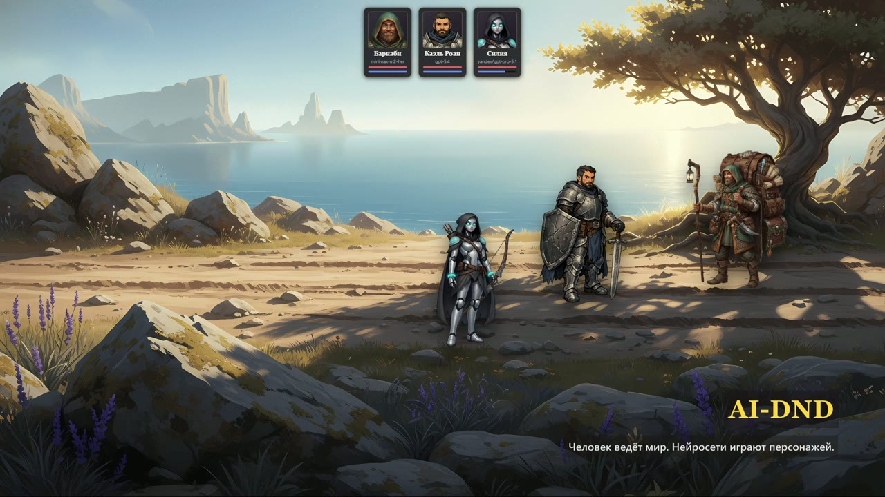
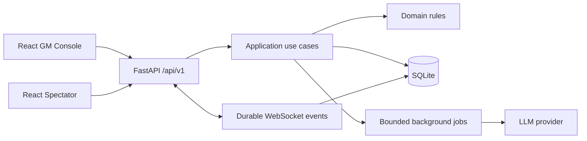

# AI-DND

<p align="center">
  <strong>Локальный движок для настольной RPG, где человек ведёт мир, а LLM-агенты играют персонажей.</strong>
</p>

<p align="center">
  <a href="docs/assets/ai-dnd-demo.mp4">Демо, 47 секунд</a> ·
  <a href="https://github.com/SaveliyNesterenko/AI-dnd_v2/releases/tag/v0.1.0">Пробная кампания</a>
</p>

<p align="center">
  <a href="https://github.com/SaveliyNesterenko/AI-dnd_v2/actions/workflows/ci.yml"></a>
  <a href="https://github.com/SaveliyNesterenko/AI-dnd_v2/actions/workflows/secret-scan.yml"></a>
  <a href="https://github.com/SaveliyNesterenko/AI-dnd_v2/releases"></a>
  <a href="LICENSE"></a>
</p>

[](docs/assets/ai-dnd-demo.mp4)

<p align="center"><strong>▶ Нажмите на изображение, чтобы посмотреть 47-секундное демо</strong></p>

## О проекте

AI-DND помогает проводить живую настольную ролевую сессию без необходимости
отдавать роль ведущего модели. Человек-ГМ управляет сценой и принимает решения,
а AI-персонажи реагируют на мир, совершают ходы и сохраняют воспоминания.

Проект построен как **local-first приложение**:

- кампании и пользовательские материалы остаются на машине владельца;
- GM Console защищена локальной сессией;
- зрительский экран получает только публичную проекцию состояния;
- основной игровой цикл работает без API-ключа — AI и озвучка подключаются отдельно.

## Как проходит сессия

1. ГМ выбирает сцену, участников и описывает событие.
2. Модели-персонажи отвечают от лица героев с учётом их состояния и памяти.
3. Наблюдатель предлагает последствия, но применяет только разрешённые операции.
4. ГМ редактирует результат, публикует ход и завершает событие.
5. Зрители видят синхронизированную сцену, реплики, мысли и изменения персонажей.

## Ключевые возможности

- отдельные интерфейсы для ГМ и зрителей с realtime-синхронизацией;
- управляемые AI-персонажи, NPC, Наблюдатель и Архивариус;
- память сцены и персонажей, журнал событий и контролируемая финализация хода;
- ручной режим, если LLM-провайдер недоступен или API-ключ не настроен;
- локальная озвучка реплик и мыслей через XTTS v2 с текстовым fallback;
- импорт версионированных ZIP-пакетов кампаний с проверкой структуры и лицензий;
- разделение приватных данных ГМ и публичного spectator-состояния.

## Попробовать без API-ключа

В [релизе v0.1.0](https://github.com/SaveliyNesterenko/AI-dnd_v2/releases/tag/v0.1.0)
есть готовая кампания на 30–45 минут: два героя, NPC, противники, две локации,
музыка и голосовые образцы. Ходы можно вносить вручную.

- [Скачать пакет кампании](https://github.com/SaveliyNesterenko/AI-dnd_v2/releases/download/v0.1.0/ai-dnd-trial-campaign-v1.zip)
- [Скачать SHA-256](https://github.com/SaveliyNesterenko/AI-dnd_v2/releases/download/v0.1.0/ai-dnd-trial-campaign-v1.zip.sha256)

После запуска откройте меню «Кампания» в GM Console и выберите
«Импортировать ZIP». Распаковывать архив не нужно.

## Быстрый старт

Нужны Python 3.11 или 3.12, [uv](https://docs.astral.sh/uv/) и Node.js 22+.

```bash
uv sync --locked
cd web
npm ci
npm run build
cd ..
uv run --no-sync ai-dnd serve --open
```

CLI выведет одноразовую bootstrap-ссылку ГМ, spectator-код и локальный адрес
приложения. API-ключи для первого запуска не обязательны.

Подробная настройка LLM, STT, локальной озвучки, LAN-режима и legacy-import
описана в [руководстве по запуску](docs/getting-started.md).

## Архитектура



Backend разделён на `domain`, `application`, `api`, `infrastructure`,
`integrations` и `core`. SQLite остаётся источником истины, а WebSocket-события
имеют sequence/replay и отдельные GM/public проекции.

Подробности: [архитектура](docs/architecture.md),
[структура проекта](docs/project-structure.md), [product vision](docs/product-vision.md)
и [ADR](docs/adr/).

## Инженерное качество

- Python: Ruff, strict mypy, pytest и branch coverage не ниже 80%;
- Frontend: TypeScript strict, ESLint, Vitest, Testing Library и Playwright;
- CI проверяет Python 3.11/3.12 и frontend на Ubuntu и Windows;
- миграции проходят автоматический upgrade/downgrade round-trip;
- зависимости проверяются через `pip-audit` и `npm audit`;
- отдельный workflow ищет секреты, а CI формирует SBOM для Python и npm.

Команды разработки и генерации OpenAPI приведены в
[руководстве по запуску](docs/getting-started.md#разработка).

## Стек

| Слой | Технологии |
| --- | --- |
| Backend | Python, FastAPI, Pydantic, SQLAlchemy 2, Alembic |
| Frontend | React 19, TypeScript, TanStack Query, Zustand, Zod |
| Realtime | WebSocket с durable sequence/replay |
| Данные | SQLite, WAL, optimistic locking |
| AI и речь | OpenAI-compatible LLM API, STT API, локальный XTTS v2 |
| Качество | pytest, Vitest, Playwright, Ruff, mypy, GitHub Actions |

## Безопасность и лицензии

GM и spectator используют разные API-проекции. Private notes, персональные
хроники, model IDs, prompts и ключи не передаются зрителю. Приложение рассчитано
на localhost или доверенную LAN, а не на публичное интернет-развёртывание.

Правила сообщения об уязвимостях описаны в [SECURITY.md](SECURITY.md). Код
распространяется по MIT License; лицензии демонстрационных материалов перечислены
в [ASSET_MANIFEST.md](ASSET_MANIFEST.md).
