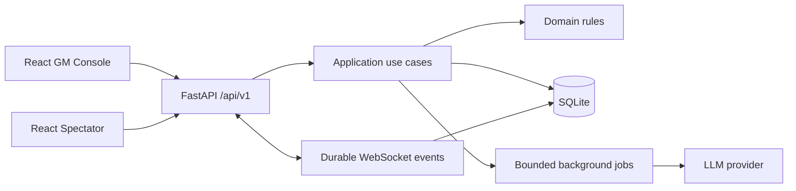

# AI-DND

Локальный движок для настольной ролевой игры, в которой человек ведёт мир, а
LLM-агенты играют персонажей, NPC, Наблюдателя и Архивариуса.

Проект строится как local-first приложение: данные кампаний остаются на машине
пользователя, GM Console защищена локальной сессией, spectator-экран получает
только публичную проекцию состояния.

> Статус: идёт поэтапная миграция с прототипа. Новый backend, SQLite-модель,
> `/api/v1` и React-интерфейсы уже являются основной архитектурой. Legacy-код
> сохранён временно для сверки поведения и импорта данных.

## Что уже реализовано

- FastAPI application factory с разделением `domain`, `application`, `api`,
  `infrastructure`, `integrations` и `core`.
- SQLite + SQLAlchemy 2 + Alembic, WAL, foreign keys, `busy_timeout`,
  optimistic locking и типизированные Observer-команды.
- Durable WebSocket-события с sequence/replay и отдельными GM/public
  проекциями.
- Фоновые LLM jobs с ограниченной конкурентностью, timeout, retry и безопасным
  degraded-режимом без API-ключа.
- React 19 + TypeScript strict, TanStack Query, Zustand, React Hook Form и Zod.
- HttpOnly GM session, spectator join code, same-origin production, security
  headers и единый `application/problem+json`.
- Транзакционный legacy-import с dry-run и отдельная самодостаточная
  demo-кампания без пользовательских media.

## Быстрый старт

Нужны Python 3.11 или 3.12, [uv](https://docs.astral.sh/uv/) и Node.js 22+.

```bash
uv sync --locked
cd web
npm ci
npm run build
cd ..
uv run ai-dnd serve --open
```

После запуска CLI выводит:

- одноразовую bootstrap-ссылку GM;
- шестизначный spectator-код;
- локальный адрес приложения.

API-ключи не обязательны: без них основной игровой цикл работает, а
AI/voice-возможности явно отображаются как недоступные.

### LAN-режим

Доступ из локальной сети выключен по умолчанию:

```bash
uv run ai-dnd serve --lan --open
```

Открывайте порт только в доверенной сети. Публичное интернет-развёртывание не
входит в модель угроз v1.

## Импорт существующей кампании

Сначала всегда выполняйте проверку:

```bash
uv run ai-dnd import-legacy ./data
```

Команда валидирует JSON и перечисляет отсутствующие assets, но ничего не
изменяет. Для реального импорта:

```bash
uv run ai-dnd import-legacy ./data --apply --name "Моя кампания"
```

Импортированная кампания становится активной и открывается при следующем запуске.
Переключить активную кампанию можно в списке «Кампания» в верхней части GM
Console. Спрайты, голоса, локации и музыка копируются в локальное системное
хранилище и не добавляются в Git.

Runtime-БД и пользовательские assets сохраняются в системной директории данных,
а не в Git checkout. JSON используется только для импорта/экспорта.

## Разработка

```bash
uv run ruff check .
uv run ruff format --check .
uv run mypy src
uv run pytest --cov=ai_dnd

cd web
npm run lint
npm test
npm run build
npm run test:e2e
```

OpenAPI контракт экспортируется командой:

```bash
uv run python scripts/export_openapi.py
cd web && npm run generate:api
```

## Архитектура



Подробности: [структура проекта](docs/project-structure.md),
[архитектура](docs/architecture.md), [product vision](docs/product-vision.md),
[ADR](docs/adr/) и [план миграции](docs/migration-status.md).

## Безопасность и приватность

- `CharacterGM` и `CharacterPublic` — разные API-проекции.
- Мысли опубликованных ходов передаются spectator и отображаются зрителям.
- Private notes, персональные хроники, model IDs, prompts и ключи spectator не получает.
- Observer может выполнять только разрешённые типизированные операции.
- Контент кампании выводится React как текст; `dangerouslySetInnerHTML` не
  используется.
- Полные prompts по умолчанию не логируются.

О найденных уязвимостях сообщайте по инструкции в [SECURITY.md](SECURITY.md).

## Лицензия и assets

Код распространяется по MIT License. Лицензии demo-материалов перечислены в
[ASSET_MANIFEST.md](ASSET_MANIFEST.md). Legacy-кампания и её media не являются
частью публичного demo и требуют отдельной проверки прав перед публикацией.
