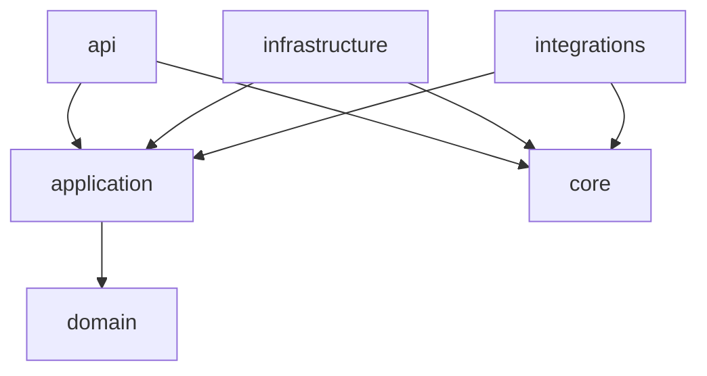

# Архитектура AI-DND

## Границы системы

`domain` содержит статусы и правила переходов без зависимостей от FastAPI,
SQLite или конкретного LLM. `application` координирует use cases и транзакции.
`api` отвечает только за транспорт, DTO, авторизацию и преобразование ошибок.
`infrastructure` реализует хранение и runtime-механизмы. `integrations`
изолирует внешние AI/voice providers. `core` содержит конфигурацию и lifecycle.

Зависимости направлены внутрь:

## Данные

SQLite является единственным source of truth. Включены foreign keys, WAL и
`busy_timeout`. Изменения схемы выполняет Alembic. Campaign revision защищает
подтверждение Observer proposal от устаревшего состояния; уникальные ключи
защищают sequence событий и ходов.

JSON — только версионированный формат обмена. Legacy importer сначала выполняет
полную валидацию и dry-run, а затем импортирует данные одной транзакцией.

## Realtime

Каждый WebSocket-клиент имеет собственную bounded queue. Событие сначала
сохраняется в БД с монотонным sequence, затем рассылается подписчикам.
Переподключение использует `last_sequence` и replay. GM получает public и GM
events, spectator — только public.

## Безопасность

GM bootstrap token хранится только в системной data directory. Bootstrap
обменивается на подписанную HttpOnly SameSite cookie. Spectator использует
read-only join code. В production CORS не нужен; dev origins перечисляются явно.

API формирует отдельные projections. Public event payload никогда не содержит
thoughts, private notes, provider metadata или prompts.

## LLM и jobs

Интеграция описана `LLMProvider`. Model profile задаёт model ID, JSON schema
capability и temperature. Вызовы выполняются как durable BackgroundJob с
ограниченной конкурентностью. Структурированный ответ валидируется Pydantic;
после двух корректирующих повторов job завершается ошибкой без изменения
кампании.

## Frontend

`/gm` и `/spectator` — отдельные lazy chunks. TanStack Query хранит server
state, Zustand — только выбранного персонажа и локальное audio/UI state.
Формы используют RHF + Zod. Контент модели рендерится обычными React nodes.
